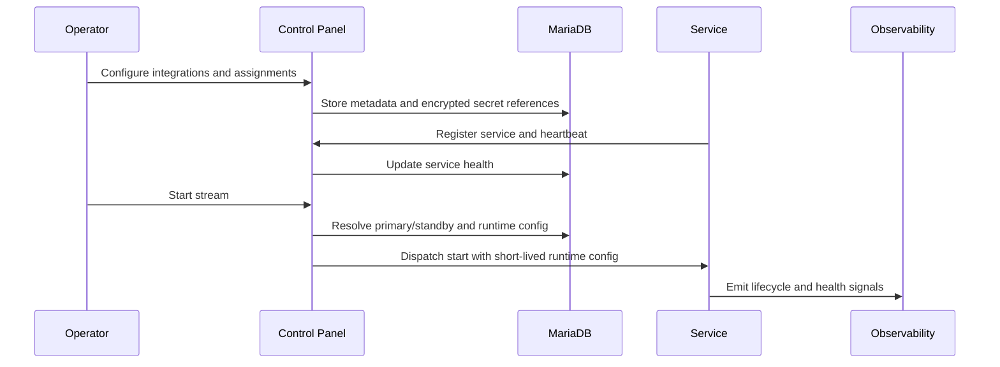

# Control Plane Diagram

Control plane は operator の操作、service registration、assignment、runtime config dispatch を扱います。

service token と OAuth credential は raw response に出しません。operator UI では configured/missing/masked/fingerprint のみを表示します。

## 読み方

この図では Control Panel がすべての処理を実行するのではなく、設定と権限を解決して service に dispatch する役割であることを示します。service は heartbeat で現在の capability と health を返し、Control Panel は primary/standby assignment に基づいて start/stop を送ります。

Control Panel は operator intent と service capability を結び付ける source of truth です。Discord config、YouTube output、Drive destination、notification channel、caption provider、service assignment は DB 上の record として管理し、実 secret は encrypted secret storage に分離します。service 側の env は bootstrap URL、service ID、service token、public URL、production/runtime-config 必須 flag に限定し、stream ごとの provider 値を固定しません。

## 確認ポイント

production 検証では、未登録 service への dispatch が拒否されること、別 service の runtime config が読めないこと、runtime secret lease が stream scope と assignment role に縛られることを確認します。

start 前の readiness では、primary service が healthy、standby が standby として登録済み、runtime config version が全 service に配布可能、integration record が configured、write-only secret が read response に出ないことを確認します。`control-panel-config.json` export はこの状態の non-secret snapshot であり、operator が手で provider URL や token を貼る場所ではありません。

## 障害時の追跡

start が失敗した場合は、UI の readiness issue、Control Panel audit log、service-health の heartbeat age、dispatch response の順に追跡します。DB の encrypted secret reference が存在しても、対象 service が primary assignment でなければ runtime secret は解決できません。operator は raw token を再入力する前に、service registration scope、assignment、runtime config version が揃っているかを確認します。

dispatch が成功して service が動かない場合は、Control Panel の責務と service の責務を分けて見ます。Control Panel 側は request validation、CSRF/session、assignment resolution、secret lease、dispatch status までを確認します。service 側は runtime config fetch、token hash match、media/input/output readiness、Observability heartbeat を確認します。どちらの領域でも raw secret を log に戻して調査しません。

## 証跡に残す値

control-plane の evidence には、service ID、assignment role、runtime config version、lease ID、status code、masked target、fingerprint を残します。service token、runtime secret、OAuth refresh token、YouTube stream key、Discord bot token は残しません。failure の再現に raw 値が必要な場合でも、operator の local shell で扱い、Markdown には hash や configured status だけを残します。

外部確認の完了証跡では、Control Panel config confirmation、provider verification record、probe summary、runner command が同じ stream ID を指すことを必須にします。古い config export、別 stream の assignment、provider verification record の `observed_at` 欠落、completion checker 未通過の evidence は、Control Plane が green に見えても完了扱いにしません。
