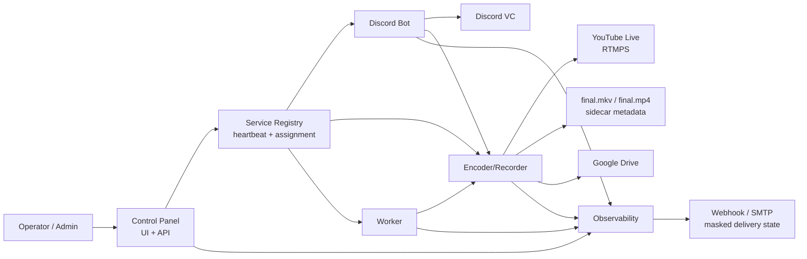

# Full System Diagram

AutoStream 全体の control plane、media plane、observability、external provider の関係です。

Control Panel は secret を配る中心ではなく、encrypted secret reference と runtime config を管理する中心です。Google Drive upload は Encoder/Recorder が archive 完了後に行い、図に出てくる provider token、stream key、webhook URL、Drive file ID は the private evidence archive に raw 値で残しません。

## 読み方

左側が operator と Control Panel、中央が AutoStream service、右側が外部 provider です。Discord Bot は Discord VC に接続し、Encoder/Recorder は media pipeline と archive を担当します。Worker は stream event を生成し、Observability は各 service から signal を受けて incident と notification に変換します。

## 確認ポイント

外部確認では、Discord VC 接続、audio packet 増加、YouTube private/test RTMPS の video/audio 受信、`final.mkv` から `final.mp4` への remux、Google Drive upload の fingerprint 証跡までを同じ stream ID に束ねて確認します。

## 運用境界

この図の矢印は secret の平文移動を意味しません。Control Panel は integration record と secret reference を管理し、service は自分の scope に必要な runtime config だけを受け取ります。Observability は signal と incident を扱い、provider credential の保管場所にはしません。外部 provider の確認結果は provider verification record として保存し、raw token ではなく masked ID、fingerprint、status、metric に変換します。

## 完了条件

全体完了は、各 service が起動するだけではなく、Control Panel 管理の設定で同じ stream ID を開始し、Discord 音声、YouTube media、archive、Drive upload、notification/readiness が secret-safe evidence として結び付く状態です。partial/fail の履歴 evidence は進捗確認には使えますが、MVP verification pass の代替にはしません。

## 変更時の読み替え

system diagram を変更するときは、矢印が control plane、media plane、archive plane、provider plane、notification plane のどれに属するかを先に決めます。新しい接続が secret を扱う場合は、保存場所、消費 service、runtime lease、evidence checker を同時に更新します。

## Operator Notes

この図は service を 1 つの repository に戻すための設計図ではありません。Control Panel は operator intent、service registry、assignment、runtime config distribution を所有し、Discord Bot、Worker、Encoder/Recorder、Observability はそれぞれ独立して deploy / rollback できる前提です。新しい requirement を追加する場合も、図の service boundary に沿って実装先と docs 先を分けます。

障害時は、図の control plane、media plane、archive plane、provider plane を順番に分けて確認します。たとえば YouTube が受信していない場合でも、Discord packet delta、Encoder forwarded RTP、RTMPS reconnect、Control Panel output config、provider verification record のどこで止まったかを分けて記録します。全 plane が同一 `stream_id` でつながるまで、外部確認は pass としません。

新しい service や provider を追加した場合は、この図の矢印を増やす前に、どの repo が設定を所有し、どの repo が runtime secret を消費し、どの evidence checker が pass 条件を判定するかを決めます。図に描かれた接続が bootstrap env fallback なのか Control Panel managed runtime config なのかを曖昧にすると、外部確認の失敗時に責任境界を追えなくなります。

## 更新ルール

図を更新するときは、単に node を増やすのではなく、開始、停止、archive、upload、notification、evidence のどの phase に影響するかを確認します。新しい矢印が secret を運ぶ場合は、raw value の保存先ではなく secret reference、runtime lease、masked proof の形で表現します。図と runbook が食い違う場合は、operator が誤った repo に修正を入れる原因になるため、diagram、configuration doc、API doc、security report を同じ PR で揃えます。
