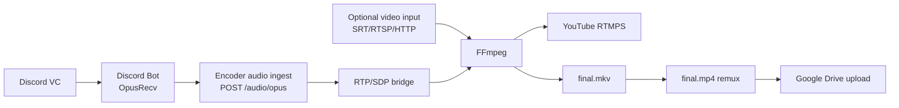

# Media Plane Diagram

Media plane は Discord audio、映像入力、FFmpeg、YouTube output、archive を担当します。

外部確認では Discord packet delta、YouTube video/audio received、`final.mkv` byte delta、`final.mp4` upload fingerprint を確認します。

## 読み方

Discord 音声は Discord Bot で受け取り、Encoder/Recorder の audio ingest に送ります。映像入力がない検証でも RTP/SDP bridge と test video で YouTube Live への audio/video proof を作れます。通常の映像入力がある場合は SRT、RTSP、HTTP などの allowed host を通した input を FFmpeg に渡します。

この図の矢印は data flow であり、secret の保存場所ではありません。Discord Bot token、YouTube stream key、SRT passphrase、Drive credential は media plane に恒久保存せず、Control Panel で管理した secret reference から runtime lease として解決します。media service が保持してよいのは、stream ID、runtime config version、input profile ID、archive artifact path、packet/byte/duration metric、masked provider identifier です。

## 確認ポイント

media failure の切り分けでは、Discord packet count、RTP forwarded count、FFmpeg process health、RTMPS reconnect count、archive byte size を順番に見ます。credential-bearing input URL と YouTube stream key は diagnostic output から redaction されている必要があります。

外部確認のpass 判定では、単一の log line ではなく各段階の delta をつなげます。Discord packet delta が正、Encoder RTP forwarded delta が正、YouTube received audio/video が true、`final.mkv` が増加、`final.mp4` remux が成功、Drive upload が real upload として fingerprint を持つ、という chain が同じ stream ID で揃って初めて media plane は完了扱いです。途中の段階だけが成功している場合は partial evidence として残し、MVP verification pass とは書きません。

## 証跡の扱い

media plane の証跡は packet delta と artifact metric を中心に残します。Discord guild/channel は masked value、YouTube broadcast/live stream は provider verification record の non-secret ID、Drive file/folder は SHA-256 fingerprint で扱います。`final.mkv` と `final.mp4` は absolute path ではなく logical relative path と byte/duration metric で記録し、host layout や credential 付き input URL を evidence に残しません。

## 復旧時の見方

音声だけが欠ける場合は Discord Bot と audio ingest を先に見ます。映像だけが欠ける場合は input source、FFmpeg graph、RTMPS response を見ます。archive だけが欠ける場合は filesystem permission、remux、Drive upload retry を分けて確認します。

復旧後は古い artifact を再利用しません。probe summary、provider verification record、completion record は復旧後の `observed_at`、runtime config version、stream ID を持つ新しい組み合わせで作り直します。これにより、一時的な手修復や local-only dry-run が production 完了として残ることを防ぎます。

## 更新ルール

media plane に新しい input、output、archive destination を追加する場合は、diagram と同時に readiness、probe summary、completion record の field を決めます。operator が見るべき値は packet count、byte count、duration、status、fingerprint、masked provider identifier であり、input URL、stream key、Drive file ID、local absolute path ではありません。図に新しい media edge を追加したら、どの service repo が retry と rollback を所有するかも本文で明示します。
