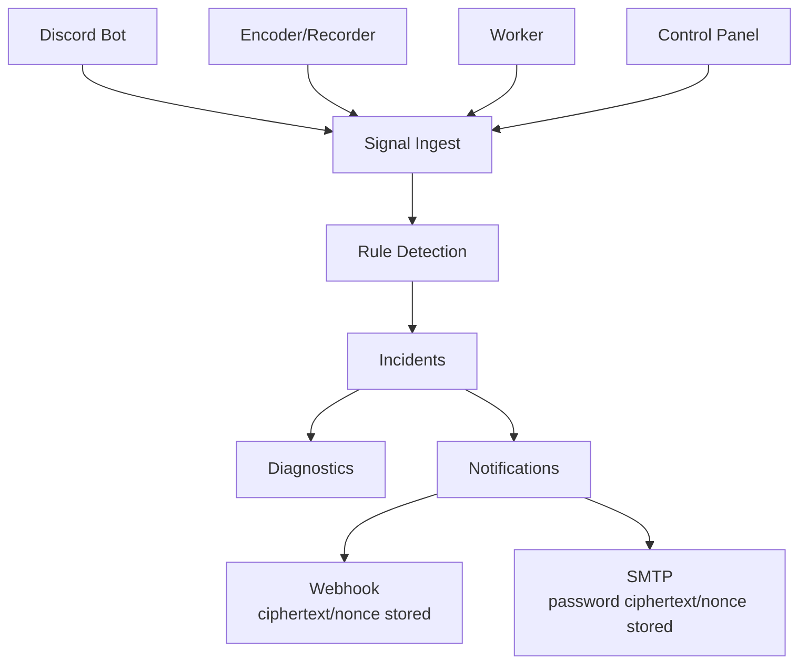

# Observability Diagram

Observability は各 service の signal を受け取り、incident、diagnostic、notification を生成します。

webhook URL と SMTP password は plaintext 保存しません。DB integration test では ciphertext/nonce だけが保存されることを確認します。

## 読み方

Observability は provider secret の保管場所ではなく、service signal を incident と operator action に変換する service です。Discord voice disconnect、Worker publish failure、FFmpeg health、archive/upload failure、notification delivery failure などを signal として受けます。

## 確認ポイント

notification channel の webhook URL と SMTP password は Control Panel 経由で write-only に扱い、Observability DB には ciphertext/nonce だけが保存されます。UI、API、evidence では delivery status、masked target、fingerprint のみを確認します。

## 運用上の読み替え

この図の Notifications は送信先そのものではなく、暗号化された channel 設定と delivery attempt の境界を表します。incident から diagnostic report を作るときも、raw webhook URL、SMTP password、OAuth token、service token は本文に展開しません。外部確認では notification readiness phase を分け、送信先が configured であること、failure 時に secret-safe な error category が残ることを確認します。

## DB 証跡

MariaDB-backed notification test では、channel 作成後に plaintext column が空で、ciphertext と nonce だけが保存されることを確認します。delivery history には provider 種別、masked target、status、attempt count、error category を残し、webhook URL や SMTP password は保存しません。operator が incident を共有するときも、delivery target は fingerprint または masked domain に寄せます。

## Revalidation

Observability の revalidation では、signal ingest、incident creation、diagnostic generation、notification delivery、remediation approval を分けて確認します。notification secret を変更した場合は、MariaDB の ciphertext/nonce、UI の masked target、delivery history の secret-safe field を同じ変更で確認します。

## Operator Notes

Observability 図は、incident を見つける流れだけでなく、通知 secret と remediation approval がどこで保護されるかを確認するために使います。signal ingest、rule evaluation、diagnostic generation、notification delivery、Control Panel approval はそれぞれ別の証跡を持ち、どれか 1 つの成功だけで復旧完了とは扱いません。

通知 channel を変更した場合は、ciphertext/nonce storage、masked target response、delivery attempt、retry exhaustion、incident resolution の各点を確認します。外部確認の記録 には raw webhook URL や SMTP password を含めず、channel type、configured status、masked target、failure class、delivery count、operator approval result だけを残します。

notification provider、incident rule、diagnostic report、remediation action を追加した場合は、この図の signal 境界を見直します。新しい signal が raw payload を含む場合は、Observability ingest で許可する field、UI に表示する field、evidence に残す field を分け、secret scanner と MariaDB integration test の両方で plaintext 保存が再発していないことを確認します。

## 更新ルール

Observability の diagram を更新するときは、signal ingest、incident persistence、notification delivery、remediation approval のどこに責務が増えるかを分けます。notification channel を追加する場合は webhook URL / SMTP password と同じ扱いにし、DB では ciphertext と nonce、UI では masked target、evidence では provider type と delivery status だけを使います。diagram だけを更新して secret storage regression test を増やさない変更は、本番運用の変更として扱いません。
