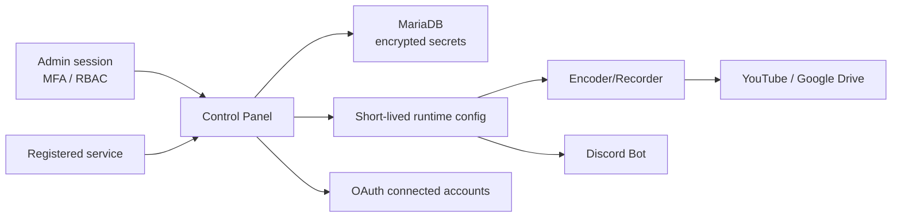

# Security Model Diagram

AutoStream の security model は、operator session、service token、runtime token、provider credential を分離します。

inbound registry/auth token と outbound dispatch secret は別物です。UI/API/evidence では secret value ではなく configured state、masked suffix、SHA-256 fingerprint を使います。

## 読み方

admin session、service token、runtime ingest token、OAuth credential は用途を分けます。service registration と heartbeat に使う token は inbound authentication 用であり、Control Panel から service へ dispatch する secret や provider credential とは混ぜません。

## 確認ポイント

production では、service token rotation が active runtime secret lease を迂回できないこと、standby service が primary-only archive secret を解決できないこと、OAuth callback が CSRF と no-store header を満たすことを確認します。

## 証跡境界

security evidence では、token の値ではなく token 種別、scope、binding、rotation 結果、lease state を記録します。Discord Bot / Worker / Encoder/Recorder はそれぞれ own-service runtime profile を使い、別 service の config や secret を読めないことをテストで固定します。OAuth connected account は refresh token を write-only とし、callback 失敗時も state、CSRF、provider error category だけを残します。

## 運用上の失敗例

service token を provider credential の代替として使う、standby service に primary の Drive destination を読ませる、OAuth callback の state failure を retry で握りつぶす、といった運用は境界違反です。失敗時は token を再発行する前に、scope、assignment、lease expiry、audit log の順に原因を分けます。

## Revalidation

security model の revalidation では、service token scope、runtime secret lease、OAuth callback CSRF、notification secret storage、Drive destination の境界を個別に確認します。図の境界を変更した場合は、schema、API、UI、service tests、docs consistency check のすべてが同じ ownership を示しているかを見ます。

## Operator Notes

この図は secret の置き場所を決めるための図ではなく、既存の Control Panel / service / provider 境界が崩れていないかを確認するための図です。新しい integration、notification channel、runtime token、OAuth provider を追加した場合は、図の該当 boundary と、実装 repository の schema / migration / UI / evidence checker が同じ ownership を示しているか確認します。

外部確認の記録では、図に出てくる境界を raw 値で証明しません。代わりに configured flag、masked identifier、fingerprint、ciphertext/nonce、fresh heartbeat、provider verification record の `observed_at` を使います。図と証跡が食い違う場合は、証跡を pass にせず、どの境界が runtime config へ配布されていないかを先に切り分けます。

security model を変更した場合は、図だけでなく schema、API docs、service tests、UI evidence を同時に確認します。特に service token scope、runtime secret lease、OAuth callback、notification secret storage、Drive destination のいずれかを変更した場合は、docs consistency checks に regression symbol を追加し、docs が古い境界を説明し続けないようにします。

## 更新ルール

security boundary の変更は、operator 向けの文言だけで完了にしません。MariaDB column、encrypted secret envelope、nonce、scope binding、CSRF state、MFA policy、provider verification record のどれを変更したかを明示し、対応する regression test と evidence checker を更新します。境界が曖昧なまま UI に configured 表示だけを足すと、実 secret がどこで保護されるかを追えなくなるため、図では保存場所と消費者を必ず分けます。
