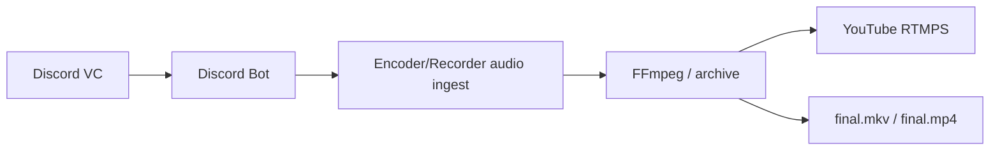

# 音声フロー

AutoStream の音声フローは、Discord Bot が Discord VC に参加し、受信した Opus packet を Encoder/Recorder に送る構成です。Control Panel は経路を割り当てますが、重い音声処理そのものは行いません。

## 基本フロー



## v1 の実装範囲

- Discord Bot は `discordgo` の `OpusRecv` から Opus packet を受信します。
- 受信 packet は Base64 化され、Encoder/Recorder の `POST /streams/{stream_id}/audio/opus` に送信されます。
- Encoder/Recorder は packet を `tmp/{stream_id}/discord-opus.jsonl` に保存します。
- `encoder_input_url` が空の場合、Encoder/Recorder は `tmp/{stream_id}/discord-opus.sdp` を生成し、受信 Opus packet を local RTP として FFmpeg に渡します。
- この mode では FFmpeg が黒背景の生成映像と Discord 音声を組み合わせ、YouTube RTMPS と `final.mkv` に同時出力します。
- Encoder/Recorder は audio bridge 中に `discord.audio_receiving`、`discord.audio_packets_total`、`media.input_timeout_sec` を Observability に送信します。
- FFmpeg 実行中は `astats` を使って `encoder.audio_level_db`、`encoder.audio_silence_sec`、`encoder.audio_clipping_total` を送信します。
- 複数話者ごとの個別音量、高度な PCM mix、音量正規化、STT 分離は後続実装です。

## audio-status

Encoder/Recorder は `GET /streams/{stream_id}/audio-status` を提供します。この API は Discord audio bridge の状態だけを返し、Opus payload や credential は返しません。

```json
{
  "stream_id": "stream-01",
  "bridge_active": true,
  "started_at": "2026-05-28T00:00:00Z",
  "last_packet_at": "2026-05-28T00:00:05Z",
  "packets_total": 42,
  "rtp_forwarded": 42,
  "last_packet_age_sec": 0
}
```

`bridge_active=true` かつ `packets_total=0` の場合、FFmpeg 用 bridge は起動していますが Discord packet はまだ届いていません。Discord Bot の VC 接続、Encoder/Recorder の public URL、短命 ingest token、Control Panel の service assignment を確認してください。

## 設定

Discord Bot 側は Bot token や guild/channel ID を env に置かず、Control Panel の Discord Bot Config から取得します。

```text
SERVICE_ID=discord-bot-01
CONTROL_PANEL_URL=https://control.example.com
CONTROL_PANEL_TOKEN=<SERVICE_TOKEN>
```

Encoder/Recorder 側も static audio token ではなく、Control Panel が stream start 時に発行する短命 ingest token を標準にします。

```text
SERVICE_ID=encoder-recorder-01
CONTROL_PANEL_URL=https://control.example.com
CONTROL_PANEL_TOKEN=<SERVICE_TOKEN>
AUTOSTREAM_STREAM_INGEST_SIGNING_KEY=<SAME_VALUE_AS_CONTROL_PANEL>
AUTOSTREAM_REQUIRE_SIGNED_INGEST_TOKENS=true
AUDIO_INGEST_TIMEOUT_SEC=5
AUDIO_INGEST_METRICS_INTERVAL_SEC=5
ENCODER_AUDIO_SILENCE_THRESHOLD_DB=-50
ENCODER_AUDIO_CLIPPING_THRESHOLD_DB=-1
```

Control Panel は stream start 時に、assigned Encoder/Recorder の `SERVICE_PUBLIC_URL` を Discord Bot の `encoder_audio_url` として渡します。

## セキュリティ

Discord token、service token、credential 付き URL、短命 ingest token はログやドキュメントに raw 値で残しません。例では必ず placeholder を使います。

## Evidence

外部確認で audio flow を pass にするには、Discord Bot の packet counter、audio forward counter、Encoder/Recorder の `packets_total` と `rtp_forwarded` の delta が同じ stream ID で増えている必要があります。VC join screenshot や Bot connected status だけでは、Encoder まで音声が届いた証跡として扱いません。

失敗時は Discord gateway 接続、VC join、Opus receive、短命 ingest token、Encoder audio endpoint、FFmpeg audio input の順に分けます。証跡には counter delta、last packet age、last forward age、error category を残し、Discord guild/channel ID や participant 名は masked value にします。

## 運用上の責務

Discord Bot は VC join と Opus receive、Encoder/Recorder は ingest endpoint と RTP/SDP bridge、Control Panel は assignment と短命 token の発行を所有します。audio failure を 1 つの generic media error にまとめると rollback 先が曖昧になるため、incident にはどの repo の責務で止まったかを残します。実provider確認 では VC に参加できたことだけでなく、Encoder 側 counter が増え、FFmpeg input health が同じ stream ID で更新されることを確認します。
