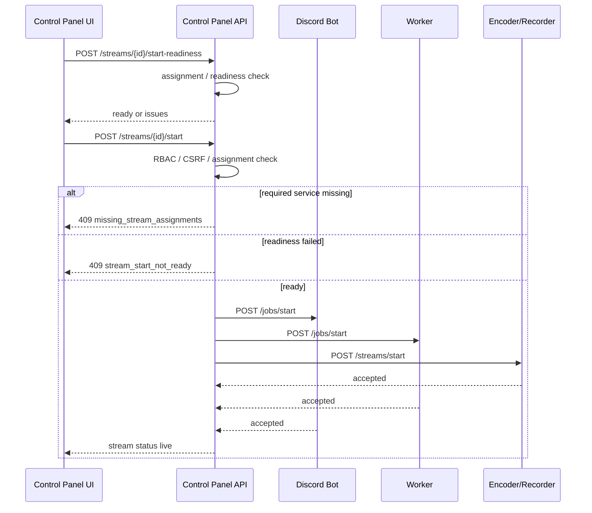
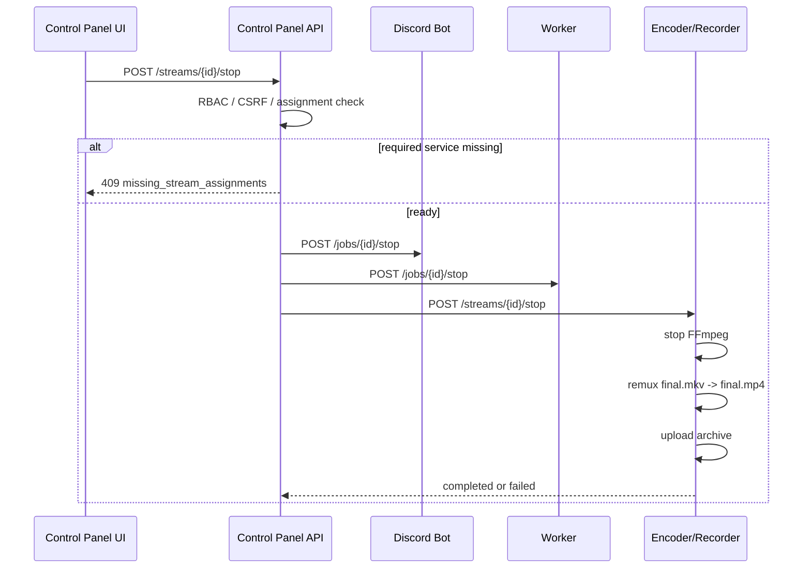

# 配信の開始と停止

配信開始と停止は Control Panel が operator intent を受け、assignment と runtime config を確認してから各 service へ dispatch する運用境界です。Discord Bot、Worker、Encoder/Recorder、Observability のどれか 1 つだけが成功しても、同じ `stream_id` に紐づく heartbeat、media packet、archive、notification / incident evidence が揃うまでは完了扱いにしません。

実 provider 値は start / stop 手順の本文に保存しません。YouTube output、Drive destination、Discord config、archive profile は Control Panel export で non-secret confirmation として確認し、外部確認では provider verification record、masked/fingerprint evidence、service assignment、runtime config version を同じ run の証跡として残します。

配信の開始と停止は Control Panel の `Streams` 画面、または Stream Jobs API から実行します。Control Panel は重い media 処理を行わず、対象 stream に割り当て済みの Discord Bot、Worker、Encoder/Recorder へ job 指示を dispatch します。

## Stream Status

Stream job は次の状態を使います。

```text
created
starting
live
stopping
completed
failed
```

`starting`、`live`、`stopping` の間は、service heartbeat、dispatch 結果、Discord audio bridge、Worker event、archive metrics を合わせて確認します。

## Streams 画面の見方

`Streams` 画面の `Stream Operations` には、選択中 stream の運用状態がまとまって表示されます。

| 項目 | 見る内容 |
| --- | --- |
| Stream | stream 名、現在 status、最終更新時刻 |
| Service assignment | `discord_bot`、`worker`、`encoder_recorder` の割り当て不足や stale heartbeat |
| Check Readiness | public URL、offline/stale、Discord audio capability、`SERVICE_CALL_TOKEN` 前提の開始前チェック |
| Discord audio | Discord Bot が VC audio を受信し、Encoder/Recorder へ forward しているか |
| Encoder audio bridge | Encoder/Recorder 側で Discord packet を受け取れているか |
| Worker events | Worker event が Encoder/Recorder の archive sidecar に保存されているか |
| Archive / upload | `final.mkv`、`final.mp4`、package、Google Drive upload、retry metrics |
| Last dispatch | 直近の start / stop / retry-upload が service ごとに成功したか |

詳細な evidence は同じ画面内の `Discord Bot audio forward`、`Worker event path`、`Worker event sidecar`、`Encoder audio bridge`、`Last service dispatch` で確認します。

## 開始フロー



開始前には、対象 stream に次の service が割り当てられている必要があります。

- `discord_bot`
- `worker`
- `encoder_recorder`

不足している場合、Control Panel は stream status を変更せず、service へ dispatch せずに `409 missing_stream_assignments` を返します。

readiness gate では次を確認します。

- `SERVICE_CALL_TOKEN` が Control Panel に設定されている。
- 割り当て済み service の `public_url` が valid な HTTP(S) URL である。
- 割り当て済み service が offline ではない。
- heartbeat が stale ではない。
- `encoder_input_url` が空の場合、Discord Bot が `audio_capture` と `audio_stream_forward` を利用できる。
- Encoder/Recorder の `public_url` を Discord Bot へ `encoder_audio_url` として渡せる。

readiness に失敗した場合は `409 stream_start_not_ready` を返します。Control Panel UI は `issues` の code、service、message を表示します。

## 停止フロー



停止時も `discord_bot`、`worker`、`encoder_recorder` の割り当てが必要です。停止対象の service を残したまま `completed` へ進めないよう、不足がある場合は `409 missing_stream_assignments` を返します。

停止後、Encoder/Recorder は archive flow を実行します。upload に失敗しても source file が残っていれば `retry-upload` で復旧できます。

## Archive Retry

`POST /streams/{id}/retry-upload` は、割り当て済み Encoder/Recorder の `POST /streams/package` を呼びます。`final.mkv` または `final.mp4` が残っている場合に、package / upload を再試行します。

対象 stream に `encoder_recorder` が割り当てられていない場合、Control Panel は `409 missing_stream_assignments` を返します。`Service Health` 画面で Encoder/Recorder を割り当ててから再実行してください。

raw Google credential、YouTube stream key、service token は API response に含めません。

## 権限

代表的な permission は次の通りです。

- `streams.read`
- `streams.create`
- `streams.update`
- `streams.start`
- `streams.stop`
- `streams.retry_upload`
- `workers.assign`
- `service_health.read`

Frontend でボタンを非表示または disabled にしていても、server-side authorization を必ず実行します。

## 失敗時

| 状態 | 対応 |
| --- | --- |
| `409 missing_stream_assignments` | `Streams` 画面の assignment と `Service Health` 画面の割り当てを確認する |
| `409 stream_start_not_ready` | response の `issues`、`SERVICE_CALL_TOKEN`、public URL、offline / stale 状態を確認する |
| `starting` のまま | service heartbeat、dispatch token、public URL、assignment を確認する |
| `live` 中に停止する | Encoder process、RTMPS reconnect、recorder write bitrate を確認する |
| `stopping` のまま | FFmpeg stop、`final.mkv`、remux log、package status を確認する |
| `failed` | Observability incident と diagnostic report を確認する |

復旧手順は [失敗した配信の復旧](../runbooks/recover-failed-stream.md) を参照してください。
