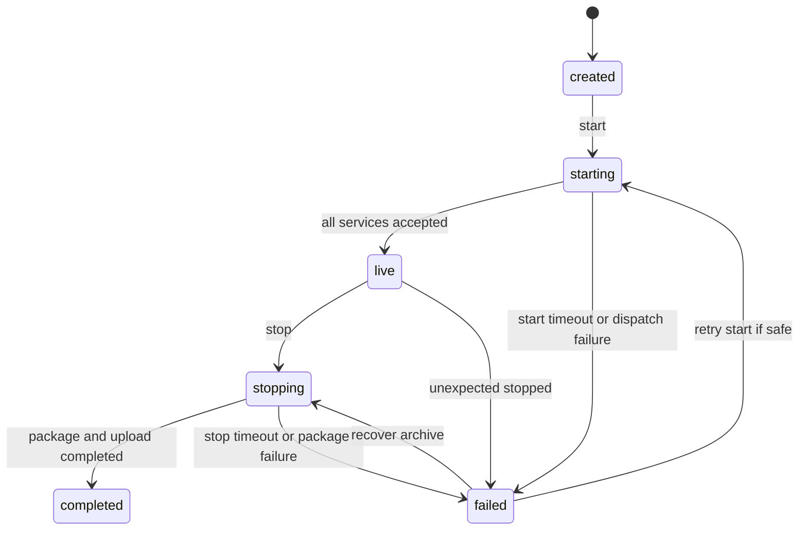

# Stream lifecycle

AutoStream の stream job は Control Panel が管理します。Discord Bot、Worker、Encoder/Recorder は割り当てられた stream job に対してだけ処理を行います。

## status

```text
created
starting
live
stopping
completed
failed
```

## 状態遷移



## `created`

stream job が作成された状態です。profile、Discord config、YouTube output、archive settings、service assignment を確認します。

本番では、この時点で readiness が pass していない stream を開始しません。Control Panel の Check Readiness で `primary_service_count`、standby、runtime config distribution、YouTube output、Drive destination、Discord Bot Config、archive profile を同じ stream ID で確認します。provider ID や folder ID は configured/fingerprint として扱い、operator handoff や evidence に raw 値を転記しません。

## `starting`

Control Panel が assigned services へ start を dispatch しています。

確認すること:

- Discord Bot が voice channel に接続できるか。
- Worker が job context を受け取ったか。
- Encoder/Recorder が FFmpeg を起動したか。
- Observability に start metrics が届くか。

start timeout が発生した場合は `failed` にします。途中で一部 service だけが accepted した場合も、手動で `live` に進めず、Last service dispatch と service heartbeat を見て retry 可能な失敗かを判断します。runtime config version が service 間でずれている場合は、service restart より先に Control Panel の assignment と integration record を修正します。

## `live`

配信中です。Control Panel と Observability で次を追跡します。

- Encoder process
- output FPS / bitrate
- RTMPS reconnect
- recorder file size / write bitrate
- Discord voice connection
- Worker event count
- archive disk free

live 中に archive を削除したり、stream key を rotation したりしないでください。

`live` の停止判断は、配信継続リスクと archive 保全リスクを分けます。Discord audio が途絶えても Encoder/Recorder が書き込みを継続している場合は、まず Bot reconnect と audio forward を復旧します。Encoder process、RTMPS output、recorder write が止まった場合は critical incident として扱い、Control Panel から stop または failover を実行する前に `final.mkv` の存在、write bitrate、disk free、YouTube provider status を確認します。

## `stopping`

Control Panel が stop を dispatch し、Encoder/Recorder が FFmpeg を停止して package / upload を実行しています。

この状態で確認すること:

- `tmp/{stream_id}/final.mkv`
- remux log
- `final/{stream_id}/final.mp4`
- Google Drive upload status

`stopping` が長引く場合、stop dispatch、FFmpeg 終了、remux、package、upload のどこで止まっているかを分けます。`final.mkv` が存在し `final.mp4` がない場合は remux failure、`final.mp4` があり upload だけ失敗している場合は Drive destination / OAuth account / Service Account permission の調査に進みます。手動再実行は retry upload を使い、raw credential や local full path を incident note に残しません。

## `completed`

配信が正常終了し、archive flow が完了した状態です。

確認する成果物:

- `final.mp4`
- `metadata.json`
- `logs.jsonl`
- optional `captions.vtt`
- optional `transcript.json`
- Drive folder / file IDs

完了判定では、Control Panel の stream status だけでなく、external verification record の provider verification record を確認します。Discord packet delta、YouTube private/test RTMPS receipt、`final.mkv` から `final.mp4` への remux、Drive upload status、notification delivery が同じ stream ID と freshness window に収まっていることを readiness check で確認します。

## `failed`

start、live、stop、package、upload のいずれかで失敗した状態です。原因調査は Observability incident と diagnostic report を起点にします。

source file が残っている場合は [失敗した配信の復旧](../runbooks/recover-failed-stream.md) を使います。

復旧時は、原因が control plane、media plane、archive、provider のどこにあるかを先に分類します。start failure は readiness と dispatch、live failure は audio/video/RTMPS、stop failure は package/upload、provider failure は YouTube/Drive/OAuth account を起点にします。`failed` から再開する場合も、新しい runtime config と assignment が確認できるまで同じ stream key や古い ingest token を再利用しません。

## audit

次の操作は audit log に残します。

- stream create
- stream start
- stream stop
- mark failed
- retry upload
- service assignment
- remediation execution

audit metadata に raw secret を含めないでください。
